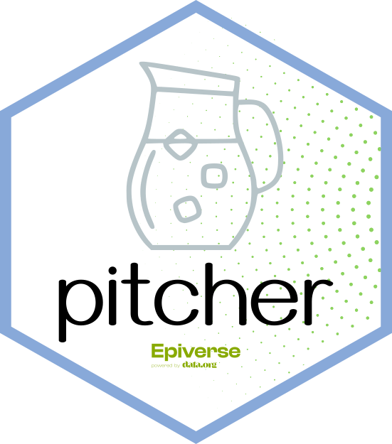

# pitcher: propose and discuss *epiverse* projects 

 

This repository is used to propose and discuss new projects for *Epiverse*. Each project has its own, dedicated issue, using a simple template to outline what the project is about. 

## Quick links

* You can find the list of projects being discussed [here](https://github.com/epiverse-trace/pitcher/discussions/categories/ideas).
* Click [here](https://github.com/epiverse-trace/pitcher/discussions/new?category=ideas) to propose a new project; alternatively, click on 'Discussions' -> 'Ideas' -> 'New discussion'.
